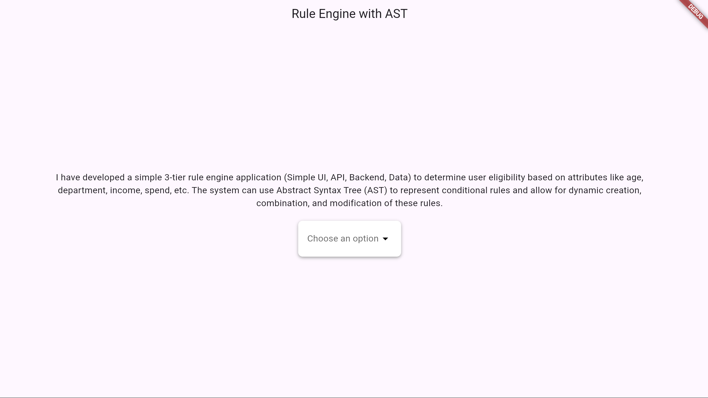
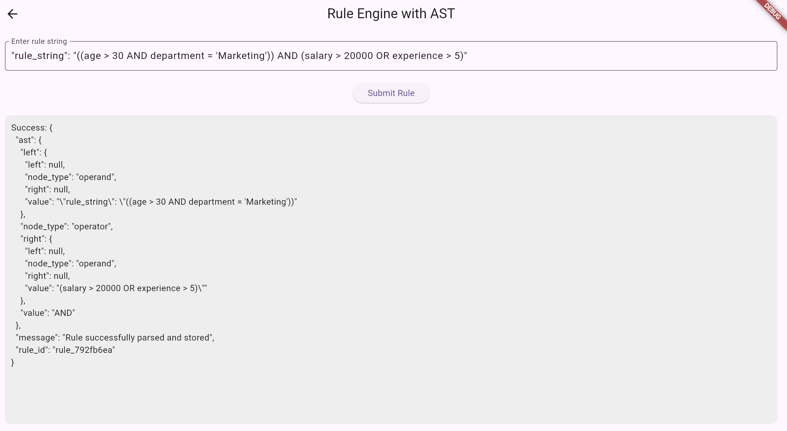
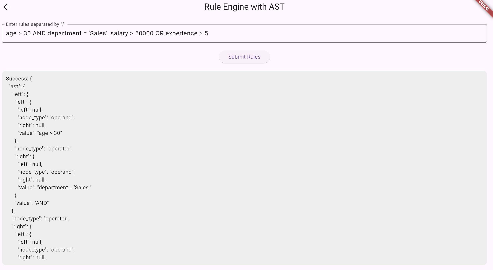
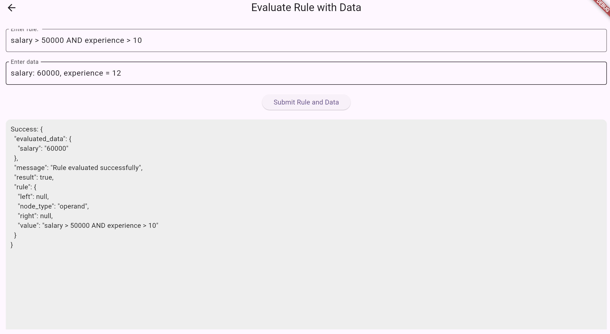

# Rule Engine AST

An Abstract Syntax Tree (AST) is a data structure that represents the hierarchical syntax of source code in a tree format. Each node of the tree corresponds to a construct occurring in the source code, such as expressions, statements, and declarations. The AST abstracts away certain syntactic details, focusing on the logical structure of the code, making it easier for compilers, interpreters, and various code analysis tools to understand and manipulate the code.

## Features

- Create AST
- Combine rules to form a new AST
- Evaluate rules and dictionary data to return true/false

## Screenshot demo
Landing page -


City search -


Alert notification - 


Historical data - 


## Prerequisites

- Flutter SDK (latest stable version)
- Python 3.12 or higher
- MongoDB

## Installation

### Frontend Setup

1. Install Flutter dependencies:
```bash
flutter pub get
```

2. Run the frontend application:
```bash
flutter run
```

The frontend will be accessible at `http://localhost:56686/`

### Backend Setup

1. Create a Python virtual environment:
```bash
pip install virtualenv
virtualenv -p 3.12 .venv
```

2. Activate the virtual environment:

For Linux/macOS:
```bash
source .venv/bin/activate
```

For Windows:
```bash
.venv\Scripts\activate
```

3. Install Python dependencies:
```bash
pip install -r requirements.txt
```

4. Create a `.env` file in the root directory with the following variables:
```env
DB_USER
DB_PASSWORD
DB_CLUSTER
DB_NAME
DB_APPNAME
```

5. Start the Flask backend server:
```bash
python rule_api.py
```

The backend will be accessible at `http://localhost:5000`

## Contributing

1. Fork the repository
2. Create your feature branch 
3. Commit your changes
4. Push to the branch
5. Open a Pull Request

## License

This project is licensed under the MIT License - see the [LICENSE](LICENSE) file for details.

## Acknowledgments

- Flutter team for the excellent cross-platform framework
- MongoDB team for the robust database solution

## Contact
[@tanish105](https://github.com/tanish105)
